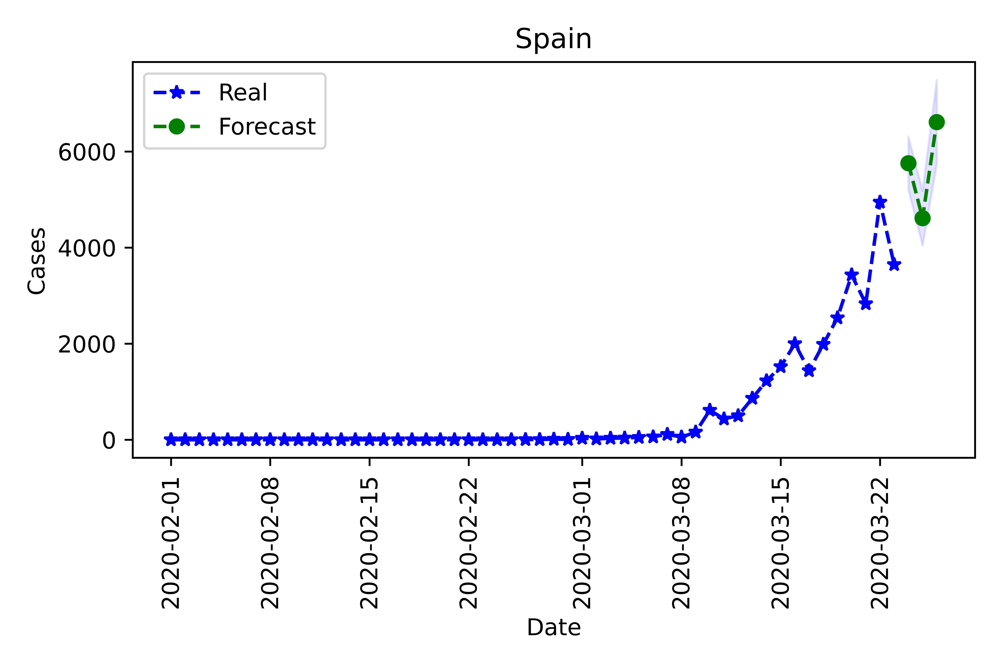
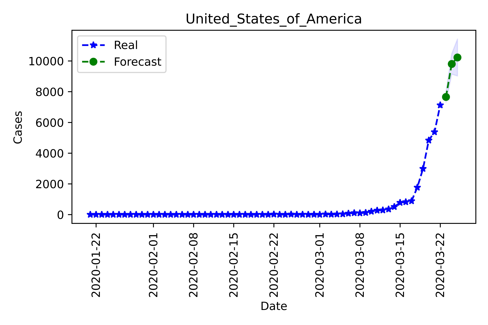

# covid_forecast
Data sources and forecast techniques applied to COVID / Coronavirus. In particular in order tome 
measure / forecast at a geografical level the impact in terms of people sick and casualties.

# we have a number of task / ideas to develop
See them [here](https://docs.google.com/spreadsheets/d/1ig0U385qGiE19JQQQrvXx4UZQdiT8dWkmxXHSlOPVTQ/edit?usp=sharing)
Get ready data, different time series approach, evaluations of scenarios and more.

# Special Thanks
Dear Coronavirus (Covid19, SARS-CoV-2,  2019-nCoV or any other fancy name), thanks for all the time I am spending at home and not going anywhere, thanks for 
my concerns about to get toilet tissue and for be damaging my hands skins with so much soaps, thanks
for the continues paranoia to give virus to the lovely elders. I thought for me to give you something back
some of this time in my house I could use it for this repo.
Also serious people and Boris Johnson say you want to kill me. That is not polite.

# Table of Contents
1. [Content](#Content)
    1. [ARIMA Forecast](##ARIMA Forecast)
        * [Materials](###Materials)
    2. [Survival Analysis](##Survival Analysis)
    3. [Kalman Filter](##Kalman Filter)
2. [Data Sources](#Data sources)
3. [Literature Review](#Literature Review)
4. [Python Enviroment](#covid_forecast.yml)

# Content
## ARIMA Forecast
For many countries using European Centro For Disease Prevention and Control Data.
There are different output and graphs including for cast for the next 3 days and graphs.

### Materials
* Notebook [here](notebooks/playing_arima.ipynb)
* Some explanation on video  [here](https://youtu.be/10pvXLKw5dQ)
* Outputs in `/outputs/arima`. Including graphs and spreadsheets. For example:


* Data source from [European Centre for Disease Prevention and Control](https://www.ecdc.europa.eu/en/publications-data/download-todays-data-geographic-distribution-covid-19-cases-worldwide)
* Script with more cases in `/analysis/playing_with_arima.py`.

## Survival Analysis
* Notebook [here](notebooks/survival_analysis.ipynb) 
## Kalman Filter
Some initial analysis. Work In progress.
# Data sources
1. Time series by country:
    1.  [European Centre for Disease Prevention and Control](https://www.ecdc.europa.eu/en/publications-data/download-todays-data-geographic-distribution-covid-19-cases-worldwide)
        * Used by: [Our World in Data](https://ourworldindata.org/coronavirus-source-data)
2. [John Hopkins Univeristy data and git](https://github.com/CSSEGISandData/COVID-19)

3. For the UK, I am exploring: https://www.gov.uk/government/publications/covid-19-track-coronavirus-cases
  

# Literature Review
## Epidemics studies Summaries. For Forecast/Prediction

1. T. Berge, J.M.-S. Lubuma, G.M. Moremedi, N. Morris & R. Kondera-Shava
    (2017) A simple mathematical model for Ebola in Africa, Journal of Biological Dynamics, 11:1,
    42-74, DOI: 10.1080/17513758.2016.1229817
    
    **ABSTRACT**
    We deal with the following question: Can the consumption of contaminated bush meat, the funeral practices and the environmental
    contamination explain the recurrence and persistence of Ebola virus
    disease outbreaks in Africa? We develop an SIR-type model which,
    incorporates both the direct and indirect transmissions in such a
    manner that there is a provision of Ebola viruses. We prove that the
    full model has one (endemic) equilibrium which is locally asymptotically stable whereas, it is globally asymptotically stable in the
    absence of the Ebola virus shedding in the environment. For the submodel without the provision of Ebola viruses, the disease dies out or
    stabilizes globally at an endemic equilibrium. At the endemic level,
    the number of infectious is larger for the full model than for the submodel without provision of Ebola viruses. We design a nonstandard
    finite difference scheme, which preserves the dynamics of the model.
    Numerical simulations are provided.
1. Chatzilena, A., van Leeuwen, E., Ratmann, O., Baguelin, M., & Demiris, N. (2019). Contemporary statistical inference for infectious disease models using Stan. Epidemics, 29, 100367.
    This paper is concerned with the application of recent statistical advances to inference of infectious disease dynamics. We describe the fitting of a class of epidemic models using Hamiltonian Monte Carlo and variational inference as implemented in the freely available Stan software. We apply the two methods to real data from outbreaks as well as routinely collected observations. Our results suggest that both inference methods are computationally feasible in this context, and show a trade-off between statistical efficiency versus computational speed. The latter appears particularly relevant for real-time applications.
1. Dugas, Andrea Freyer et al. “Influenza forecasting with Google Flu Trends.” PloS one vol. 8,2 (2013): e56176. doi:10.1371/journal.pone.0056176
    **Background**
    We developed a practical influenza forecast model based on real-time, geographically focused, and easy to access data, designed to provide individual medical centers with advanced warning of the expected number of influenza cases, thus allowing for sufficient time to implement interventions. Secondly, we evaluated the effects of incorporating a real-time influenza surveillance system, Google Flu Trends, and meteorological and temporal information on forecast accuracy.
    
    **Methods** 
    Forecast models designed to predict one week in advance were developed from weekly counts of confirmed influenza cases over seven seasons (2004–2011) divided into seven training and out-of-sample verification sets. Forecasting procedures using classical Box-Jenkins, generalized linear models (GLM), and generalized linear autoregressive moving average (GARMA) methods were employed to develop the final model and assess the relative contribution of external variables such as, Google Flu Trends, meteorological data, and temporal information.
    
    **Results**
    A GARMA(3,0) forecast model with Negative Binomial distribution integrating Google Flu Trends information provided the most accurate influenza case predictions. The model, on the average, predicts weekly influenza cases during 7 out-of-sample outbreaks within 7 cases for 83% of estimates. Google Flu Trend data was the only source of external information to provide statistically significant forecast improvements over the base model in four of the seven out-of-sample verification sets. Overall, the p-value of adding this external information to the model is 0.0005. The other exogenous variables did not yield a statistically significant improvement in any of the verification sets.
    
    **Conclusions** 
    Integer-valued autoregression of influenza cases provides a strong base forecast model, which is enhanced by the addition of Google Flu Trends confirming the predictive capabilities of search query based syndromic surveillance. This accessible and flexible forecast model can be used by individual medical centers to provide advanced warning of future influenza cases.

2. Escobar, L.E., Qiao, H. & Peterson, A.T. Forecasting Chikungunya spread in the Americas via data-driven empirical approaches. Parasites Vectors 9, 112 (2016). https://doi.org/10.1186/s13071-016-1403-y
    **Abstract**
    **Background:** Chikungunya virus (CHIKV) is endemic to Africa and Asia, but the Asian genotype invaded the Americas in 2013. The fast increase of human infections in the American epidemic emphasized the urgency of developing detailed predictions of case numbers and the potential geographic spread of this disease.
    
    **Methods:** We developed a simple model incorporating cases generated locally and cases imported from other countries, and forecasted transmission hotspots at the level of countries and at finer scales, in terms of ecological features.
    
    **Results:** By late January 2015, >1.2 M CHIKV cases were reported from the Americas, with country-level prevalences between nil and more than 20 %. In the early stages of the epidemic, exponential growth in case numbers was common; later, however, poor and uneven reporting became more common, in a phenomenon we term "surveillance fatigue." Economic activity of countries was not associated with prevalence, but diverse social factors may be linked to surveillance effort and reporting.
    
    **Conclusions:** Our model predictions were initially quite inaccurate, but improved markedly as more data accumulated within the Americas. The data-driven methodology explored in this study provides an opportunity to generate descriptive and predictive information on spread of emerging diseases in the short-term under simple models based on open-access tools and data that can inform early-warning systems and public health intelligence.
Keywords: Epidemic, Transmission, Disease model, Vector-borne, Passenger flow
3. LEKONE, Phenyo E.; FINKENSTÄDT, Bärbel F. Statistical inference in a stochastic epidemic SEIR model with control intervention: Ebola as a case study. Biometrics, 2006, vol. 62, no 4, p. 1170-1177.

    **Summary**. A stochastic discrete-time susceptible-exposed-infectious-recovered (SEIR) model for infectious
    diseases is developed with the aim of estimating parameters from daily incidence and mortality time series
    for an outbreak of Ebola in the Democratic Republic of Congo in 1995. The incidence time series exhibit
    many low integers as well as zero counts requiring an intrinsically stochastic modeling approach. In order to
    capture the stochastic nature of the transitions between the compartmental populations in such a model we
    specify appropriate conditional binomial distributions. In addition, a relatively simple temporally varying
    transmission rate function is introduced that allows for the effect of control interventions. We develop
    Markov chain Monte Carlo methods for inference that are used to explore the posterior distribution of the
    parameters. The algorithm is further extended to integrate numerically over state variables of the model,
    which are unobserved. This provides a realistic stochastic model that can be used by epidemiologists to
    study the dynamics of the disease and the effect of control interventions.
    **Key words**: Control intervention; Ebola epidemics; Estimating transition rates; Latent process; Stochastic
    SEIR model.

4. Tabataba, F. S., Chakraborty, P., Ramakrishnan, N., Venkatramanan, S., Chen, J., Lewis, B., & Marathe, M. (2017). A framework for evaluating epidemic forecasts. BMC infectious diseases, 17(1), 345.

    **Abstract**

    **Background**: Over the past few decades, numerous forecasting methods have been proposed in the field of epidemic forecasting. Such methods can be classified into different categories such as deterministic vs. probabilistic, comparative methods vs. generative methods, and so on. In some of the more popular comparative methods, researchers compare observed epidemiological data from the early stages of an outbreak with the output of proposed models to forecast the future trend and prevalence of the pandemic. A significant problem in this area is the lack of standard well-defined evaluation measures to select the best algorithm among different ones, as well as for selecting the best possible configuration for a particular algorithm.

    **Results**: Inthispaperwepresentanevaluationframeworkwhichallowsforcombiningdifferentfeatures,error measures, and ranking schema to evaluate forecasts. We describe the various epidemic features (Epi-features) included to characterize the output of forecasting methods and provide suitable error measures that could be used to evaluate the accuracy of the methods with respect to these Epi-features. We focus on long-term predictions rather than short- term forecasting and demonstrate the utility of the framework by evaluating six forecasting methods for predicting influenza in the United States. Our results demonstrate that different error measures lead to different rankings even for a single Epi-feature. Further, our experimental analyses show that no single method dominates the rest in predicting all Epi-features when evaluated across error measures. As an alternative, we provide various Consensus Ranking schema that summarize individual rankings, thus accounting for different error measures. Since each Epi-feature presents a different aspect of the epidemic, multiple methods need to be combined to provide a comprehensive forecast. Thus we call for a more nuanced approach while evaluating epidemic forecasts and we believe that a comprehensive evaluation framework, as presented in this paper, will add value to the computational epidemiology community.
    
    **Keywords**: Epidemicforecasting,ErrorMeasure,Performanceevaluation,Epidemic-Features,Ranking 
4. Venna, A. Tavanaei, R. N. Gottumukkala, V. V. Raghavan, A. S. Maida and S. Nichols, "A Novel Data-Driven Model for Real-Time Influenza Forecasting," in IEEE Access, vol. 7, pp. 7691-7701, 2019.
    
   We provide data-driven machine learning methods that are capable of making real-time influenza forecasts that integrate the impacts of climatic factors and geographical proximity to achieve better forecasting performance. The key contributions of our approach are both applying deep learning methods and incorporation of environmental and spatio-temporal factors to improve the performance of the influenza forecasting models. We evaluate the method on Influenza Like Illness (ILI) counts and climatic data, both publicly available data sets.

### Interesting libraries and repositories  

1. Blog - Python Example
    * https://towardsdatascience.com/using-kalman-filter-to-predict-corona-virus-spread-72d91b74cc8
    * https://github.com/Rank23/COVID19
2. Notebook from Kaggle
    * https://www.kaggle.com/shubhamai/coronavirus-eda-future-predictions
    
## For Survival Analysis

    
# covid_forecast.yml
covid_forecast.yml is the enviroment with the lybraries install it do:

```python
conda env create -f covid_forecast.yml
```
To use conda enviroment management in general click [here](https://docs.conda.io/projects/conda/en/latest/user-guide/tasks/manage-environments.html)
## Your first time
I recommend to use anaconda here how to set up the thing:
[Set up anaconda and jupyter Windows](https://www.youtube.com/watch?v=LrMOrMb8-3s)
[Set up anaconda an jupyter Mac - Linux](https://www.youtube.com/watch?v=E4k38RIUKvo)

## Using Jupyter notebooks

```python
conda env create -f covid_forecast.yml
```

Make the kernel available for jupyter notebooks.


```bash
conda install -c anaconda ipykernel
```

```python
python -m ipykernel install --user --name covid_forecast --display-name "Python (covid_forecast)"
```

Now run the notebook server:
```python
jupyter notebook
```
Now you should be able to see Jupyter.

## Using Pycharm

[Brief Video](https://www.youtube.com/watch?v=KKE0CTPNodA)